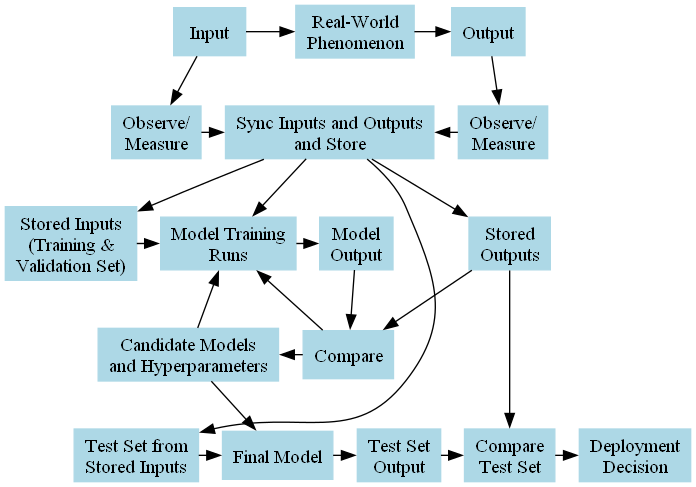

# ai-notes
A place to keep notes and program snippets for AI concepts.

## plot_entropy.ipynb

Developed in Google Colab.  Displays several graphs to help visualize and understand information entropy.

## functions_of_two_boolean_variables.ipynb

Developed in Google Colab.  Displays all sixteen possible functions of two boolean variables.  This is helpful for understanding why the total number of possible functions for n number of boolean input variables is 22n.

**Update**: since writing this, I discovered a Wikipedia entry that covers this topic better and in much greater and meaningful detail:
[Truth Table (Wikipedia)](https://en.wikipedia.org/wiki/Truth_table)

## restaurant_decision_tree.ipynb

This notebook implements in Python the restaurant decision tree algorithm pseudocode from Chapter 19 in:

Russell, Stuart, and Peter Norvig. *Artificial Intelligence: A Modern Approach.* 4th ed. Pearson, 2020.

I also add my own code that uses graphviz to render a graphical representation of the decision tree and use it for inference.

## restaurant_waiting_examples.csv
The data from the AIMA textbook.  The "restaurant_decision_tree.ipynb" notebook reads this and uses it as the training set.

## ml_overview_diagram.ipynb
A high-level overview of the machine learning process as I understand it.  I first drew this diagram by hand then gave a PNG version to ChatGPT.  I asked for graphviz code that would reproduce the hand-drawn diagram.  I would say it got it about 90% correct.  I then fixed the errors and added a few more enhancements to the graphviz code that ChatGPT gave me.

The final product:

## context_embed_exploration.ipynb
An experiment with BERT contextual embeddings. The purpose is to examine how a word used in slightly different sentences but with the same meaning can still get a similarity score of less than one.  Also, I added some sentences which use that same word with a different meaning and verified that their similarity scores are much less than one.

## linear_regression_house_price.ipynb
This is an experiment that calculates a linear regression analytically, then attempts to "learn" the slope/intercept parameters using gradient descent.  The analytically determined parameters serve as "ground truth" that allow me to determine how well various gradient descent algorithms and parameters worked.  I first tried my own naïve ideas that modified the learning rate as the training process ran.  These did not work very well.  I then copied in code that implemented the "Adam" optimizer and this worked much better.  It locked in on the true slope/intercept at about 20,000 iterations without much tuning. 